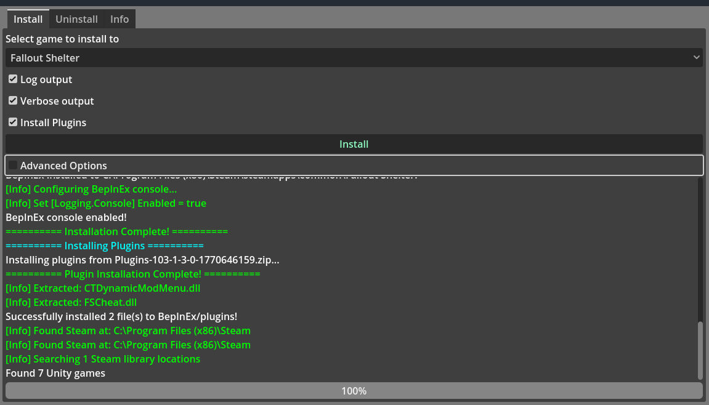
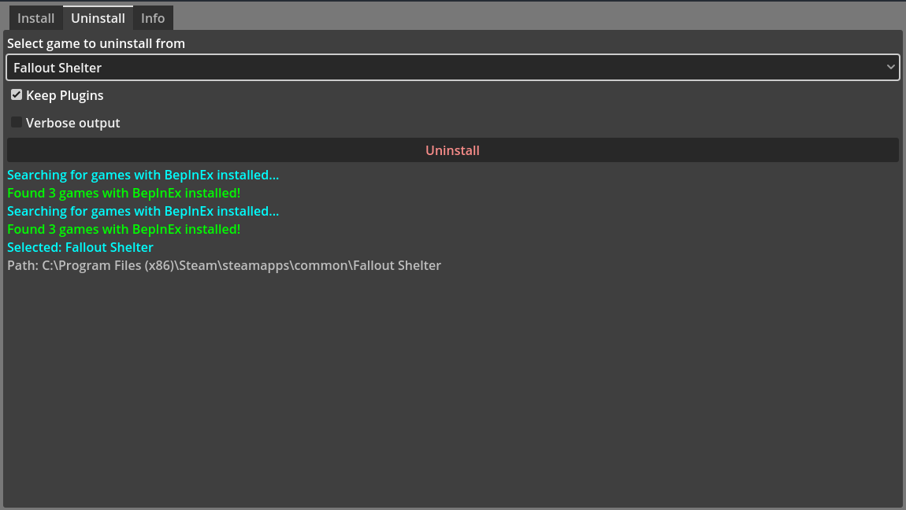
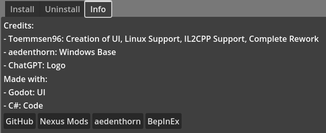

# BepInExInstaller - GUI
GUI - Tool to install BepInEx and plugins into games

## Features
- Detects compatible Steam games automatically
- Install Plugins by providing a .zip file to install automatically
- Automatically configures Proton on linux (game needs to be launched once first)
- Windows and Linux (with Proton) support
- Automatically Install and Uninstall BepInEx
- Mono-Based and IL2CPP-Based are supported
- Adv: Enable Console output, manual options

## Pictures

Click to view screenshots

_Install Tab_

_Uninstall Tab_

_Info Tab_

## Credits
- Toemmsen96 - Complete Rework, Linux Support, GUI, IL2CPP
- aedenthorn - Windows Base-CLI
## More
CLI-Edition: https://github.com/Toemmsen96/BepInExInstaller